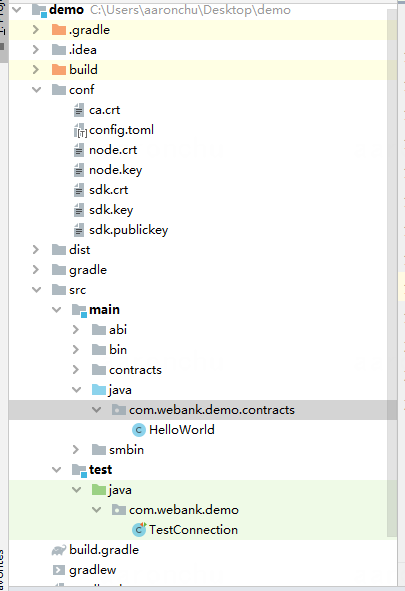

# 智能合约脚手架使用说明

## 简介
智能合约脚手架用于一键式生成DAPP应用开发工程，从而降低应用开发的难度。用户将自己的合约导入脚手架，即可生成对应的应用开发模板工程，包含了java合约、测试代码等。此外，当用户修改了合约时，不必再使用控制台重新编译，而是可通过植入项目的gradle插件进行编译，新编译的java合约会被更新到项目中。

## 前置依赖

在使用本组件前，请确认已安装相关依赖软件，清单如下：

| 依赖软件 | 说明 |备注|
| --- | --- | --- |
| FISCO-BCOS | >= 2.7.1 | |
| Java | JDK[1.8] | |
| Solidity | 0.4.25 | |
| Git | 下载安装包需要使用Git | |


## 快速开始
目前支持基于命令行的方式，后续会推出基于可视化的使用方式，进一步降低用户使用的难度。

### 合约准备
用户需要提前准备如下信息：

| 材料 |  说明|
| --- | --- |
|智能合约|智能合约solidity文件|
|证书|用于连接区块链的证书，用户可从节点sdk目录 或 控制台的conf目录获取|


### 源码下载
```
cd ~
git clone git@gitee.com:yuzhichu/solscaffold.git 
cd solscaffold/scaffold-cmd 
```
### 运行脚手架

```
gradle build
cd dist
java -jar scaffold-cmd.jar -p [peers] -s [solidity directory] -c [cert directory] -o [output directory]
```

配置说明如下：
| 配置 |  说明|可选| 
| --- | --- | --- |
|-p|连接节点，若多个节点用逗号分隔，例如127.0.0.1:20200,127.0.0.1:20201||
|-s|智能合约solidity文件的目录||
|-o|输出目录，新的项目会在这个目录下被创建。如果同名项目已经存在，则会报错||
|-f|合约过滤通配符，用于选择合约，例如*Controller，则只会读取Controller结尾的合约。默认选择所有合约|可选|

您也可以使用help命令获取说明：
```
Usage: ScaffoldRunner -c=<certDir> [-f=<filter>] -o=<output> -p=<peers>
                      -s=<solidityDir>
  -c, --cert=<certDir>      Ca cert directory
  -f, --filter=<filter>     Contract filter, you can use wild char
  -o, --output=<output>     Output directory
  -p, --peers=<peers>       Peers to connect, split by comma
  -s, --sol=<solidityDir>   Solidity contracts dir
```

### 生成效果
运行成功后，可在artifact目录下得到项目工程，如下示例：



可直接运行新的工程的测试用例，该测试用例会测试和节点的连接性，如未报错即为成功：
```
cd [demo directory]
gradle test
```

### 合约更新

当用户基于生成的项目进行开发时，若需要修改合约，用户在修改完合约后，可在项目工程目录下直接编译合约：
```
cd [demo directory]
gradle solc
```

新的java合约及abi、bin会被刷新到目录下。
